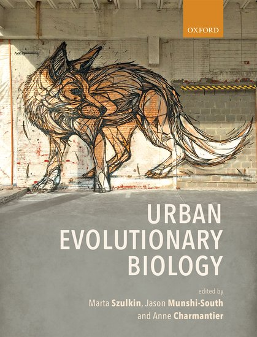

## Code and pipelines

Analysis code from the lab is shared on [GitHub](https://github.com/lindsaymiles).

## Urban Evolution Research

There are many resources out there, but here are a few I have been involved in:

[Dr. Elizabeth Carlen](https://www.elizabethcarlen.com/) and I co-first authored [A beginner's how-to guide to urban population genetics and genomics](https://doi.org/10.1002/ece3.73372), which gives a broad overview for getting started with population genetics. There are other "how-to" papers, but they generally focus on a specific program used in population genetics.

Another cool paper that came about from a collaborative network is [Online toolkits for collaborative and inclusive global research in urban evolutionary ecology](https://doi.org/10.1002/ece3.11633), with an associated [website for the toolkit](https://www.urbanevoecotools.org/index.html).

[{.float-end .ms-4 .mb-3 .shadow-sm width="150"}](https://global.oup.com/academic/product/urban-evolutionary-biology-9780198836858)
And of course there's the textbook, [Urban Evolutionary Biology](https://global.oup.com/academic/product/urban-evolutionary-biology-9780198836858).

::: {.clearfix}
:::
